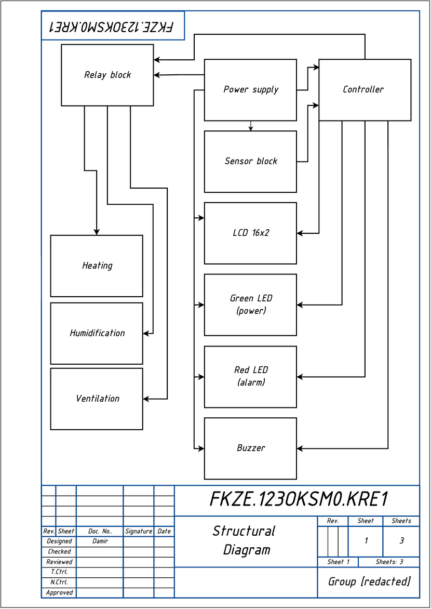

# EQF Level 5 Qualification Work — ESP32 Air Quality Monitoring & Control System

An automated microprocessor-based system for monitoring and controlling air quality in residential and industrial premises, built around a dual-core ESP32 running FreeRTOS. It combines a BME280 (temperature/humidity/pressure) and an MQ-2 gas/smoke sensor with three opto-isolated relay channels (ventilation, heating, humidification), a 16×2 LCD, a buzzer/LED alarm, and dual telemetry over Bluetooth SPP and MQTT (Home Assistant).

This repository is the English-language, GitHub-formatted version of an EQF Level 5 ("fakhovyi molodshyi bakalavr") qualification work completed at Y. O. Paton Vocational College of Welding and Electronics, specialty 123 Computer Engineering. The original is a Ukrainian-language explanatory note with three engineering drawings; both have been translated, and the firmware described in them has been implemented and flashed to the hardware built for the project.

## Why this exists

Most DIY and even commercial indoor air-quality monitors stop at *reporting* a number. This project closes the loop: the same device that measures temperature, humidity, and combustible-gas concentration also directly drives the ventilation, heating, and humidification hardware, with software hysteresis to avoid relay chatter and a hard-coded gas-alarm override that forces ventilation on and blocks heating regardless of what the temperature/humidity logic wants. See [`docs/thesis.md`](docs/thesis.md) section 1.3 for a comparison against AirGradient ONE, Atmotube PRO 2, and Airthings View Plus.

## Repository layout

| Path | Contents |
|---|---|
| [`firmware/`](firmware/) | PlatformIO project: ESP32 application code + a hardware-independent control-logic library with unit tests. **Builds and tests pass**, see below. |
| [`hardware/`](hardware/) | The three engineering drawings (structural diagram, code flowchart, electrical schematic), translated and de-identified, as an editable `.drawio` source plus rendered PNG/PDF. |
| [`docs/thesis.md`](docs/thesis.md) | Full English translation of the explanatory note ("Пояснювальна записка"): requirements, component selection, reliability/power calculations, relay-block circuit design, economic analysis, occupational safety. |
| [`docs/bom.md`](docs/bom.md) | Bill of materials for the electrical schematic. |
| [`docs/review.md`](docs/review.md) | Academic advisor's review of the work (translated; advisor's name and the plagiarism-check document ID are redacted for confidentiality). |

## Firmware status

The firmware is complete and has been flashed to the assembled hardware:

- `pio test -e native` — **11/11 unit tests pass** for the hardware-independent control logic (`firmware/lib/control_logic/`): hysteresis behavior, the MQ-2 120 s warm-up timer, the gas-alarm state machine (with its 30 s safe-hold to clear), and the combined climate controller (gas alarm forces ventilation on / blocks heating).
- `pio run -e esp32dev` — the full firmware compiles and links for a real ESP32 target (Flash 81.8%, RAM 18.1%).
- **On-device test:** flashed to the assembled board and confirmed working end to end — smoke from a smoldering piece of paper held near the MQ-2 triggered the gas alarm (buzzer, red LED, "FIRE/GAS" display message), the ventilation relay engaged, and the connected fan switched on and ran in the correct direction. Bluetooth SPP and MQTT telemetry were also confirmed live. The heating and humidifier channels share the same `HysteresisChannel`/`RelayDriver` code path exercised by the ventilation test, just on different GPIO pins and thresholds.

See [`firmware/README.md`](firmware/README.md) for build instructions and notes on the MQ-2 calibration curve (the sensor is inherently ±20–30% accurate even after calibration per `docs/thesis.md` §2.2 — the on-device test confirms detection and the control response, not absolute ppm accuracy).

## System architecture

- **Sensing:** BME280 over I2C (temperature, humidity, pressure); MQ-2 analog gas/smoke sensor with a 120 s warm-up period before its readings are trusted.
- **Control:** software hysteresis per channel (ventilation, heating, humidification) so actuators don't chatter near a threshold; a gas-concentration alarm overrides everything else, forcing ventilation on and blocking heating until the gas level has stayed safe for 30 continuous seconds.
- **FreeRTOS task split:** Core 1 — sensor polling, control logic, alarm watchdog, LCD; Core 0 — Bluetooth SPP telemetry, MQTT telemetry, LittleFS event logging. Full table in `docs/thesis.md` §2.4.
- **Telemetry:** Bluetooth SPP (plain-text line every 5 s, for a phone with no network needed) and MQTT (per-parameter topics under `home/airmonitor/*`, for Home Assistant).
- **Safety:** PC817 opto-isolation between the ESP32 and the 220 V relay side, RC snubbers on each relay channel, a hardware watchdog and brownout detector, and a LittleFS event log for post-incident diagnosis.

Full derivation of the component choices, the reliability calculation (MTBF ≈ 38,168 h), the power budget (~2.05 W baseline, ~1.64 W with adaptive power saving), and the relay-driver component calculations (R1, base resistor, snubber RC values) are in [`docs/thesis.md`](docs/thesis.md) sections 2.3–2.6.

## License

Licensed under [PolyForm Noncommercial 1.0.0](LICENSE) — free for personal, educational, and other noncommercial use. For a commercial license, contact Damir at damir.brera.eb@gmail.com.
